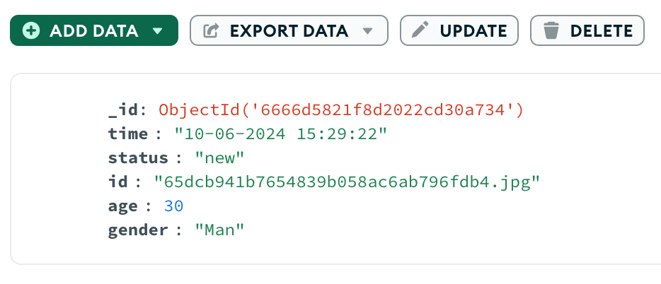

# customer_recognition
Customer cafe recognition software prototype. Remembers customers and logs each time they come. 



## Run
1. Install `MongoDB`
2. Install `pip` dependencies
```sh
pip3 install -r requirements.txt
```
3. Run `main.py`
```sh
python3 src/main.py
```

## LICENSE
All code is licensed under the MIT license.